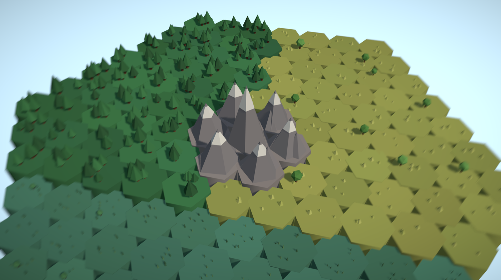

# Project Flourish

> Build a civilization that flourishes *with* nature — not against it — across seven ages of technology, guided by a single **Planetary Flourishing** score that only rises when human well-being and biodiversity rise *together*.

**▶ [Play it in your browser](https://agarg5.github.io/project-flourish/)** — no install, just a link.



A calm, hopeful 3D sandbox in the browser. No clock, no fail state: shape habitat and wildlife arrives on its own; neglect nature and the economy that funds everything quietly throttles. Ecology is a multiplier, not a constraint — and the math enforces it (`Flourishing = Wellbeing × Biodiversity`).

## Run it

```sh
bun install
bun run dev        # → http://localhost:5173
```

```sh
bun test           # headless simulation tests (the sim runs without a renderer)
bun run fastforward  # play five strategies 600 ticks ahead, dump CSVs to tmp/
```

## How it's built

TypeScript + Vite + React Three Fiber + Zustand. The simulation is pure TypeScript with no rendering dependencies — deterministic, fixed-timestep, and unit-tested headless; the 3D scene and HUD are pure consumers of its state.

The full design — vision, simulation model, spatial model, data schemas, and build roadmap — lives in the numbered docs under [`planning/`](planning/) ([start here](planning/00_README_START_HERE.md)).

## Status

- ✅ M0–M2: world render, dual-zoom camera, headless sim core, live HUD
- ✅ M3: build & steward menu, click-to-place, KayKit CC0 building models, construction grow-in, player-confirmed age-up
- ✅ M4: tech tree UI + content through the Industrial age — the full progression spine is playable (save/load, restart, minimap, pannable 271-cell world along the way)
- ⏳ M5–M6: late-game restoration (reintroduction, dead-zone terraforming), polish

Building models: [KayKit Medieval Hexagon Pack](https://github.com/KayKit-Game-Assets/KayKit-Medieval-Hexagon-Pack-1.0) by Kay Lousberg (CC0).
